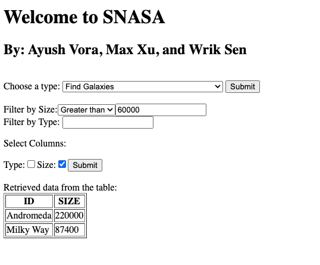
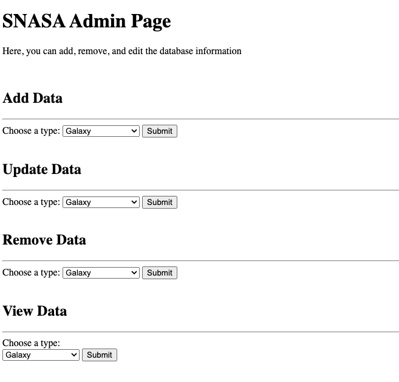

# SNASA
## by Wrik Sen, Ayush Vora, and Max Xu
A full-stack project with a PHP/SQL backend and HTML/JS frontend. 
Created a schema for a relational database that runs on Oracle DBMS, and a frontend for users to access and modify the database.

### FrontEnd
****
<ins>Home Page</ins>
The image below shows an example usage of the home page that general users will use. This particular instance demonstrates a user requesting a list of galaxies with a size greater than 60,000.

<ins>Admin Page</ins>

