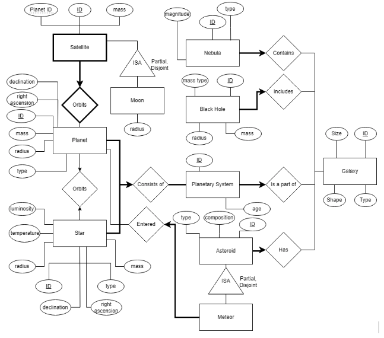

# Project Specifications

## <ins>Project description</ins>
A database of data on stars, planets, star systems, and astronomical entities. This includes a collection of classifications.

## <ins>Domain of application for Project</ins>
The domain of knowledge is in Astronomy and Cosmology. This involves specific knowledge in the classification of stars, planets, moons, galaxies, and other celestial bodies. One could use this when researching specific stars such as looking for coordinate locations in the database. Afterwards, the application would provide efficient access to related data. 

## <ins>Use Cases</ins>
One possible usage is an analysis on stars using its attributes. An example of this is a collection of the information for a set of stars involving their luminosity, and their surface temperature. This is how main sequence stars are classified. Other possible analyses for celestial bodies could be carried out if their attributes are easily accessible through the database. Specific analysis could be done on entities by filtering attributes, such as planets by size.

## <ins>ER Diagram</ins>
The following defines the entity relationship diagram for the database that will be implemented:

